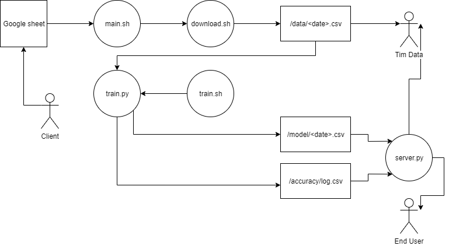

# Gambaran umum



# Memulai

## Menjalankan pipeline

```
source .env && ./main.sh
```

## Menjalankan `server.py`

```
source .env && python server.py
```

# Edit training set

[Klik di sini](https://docs.google.com/spreadsheets/d/14S897WRf0U-CLFws4YSXRf3tUJ0HhwjqTvQ3qZKiijE/edit#gid=0)

# Data beneran (buat coba-coba)

[Klik di sini](https://www.kaggle.com/uciml/iris)

# Artikel

[Klik di sini](https://medium.com/@gofrendiasgard/shell-script-teknologi-peradaban-kuno-dengan-segudang-manfaat-9e3fdf8b97ca)